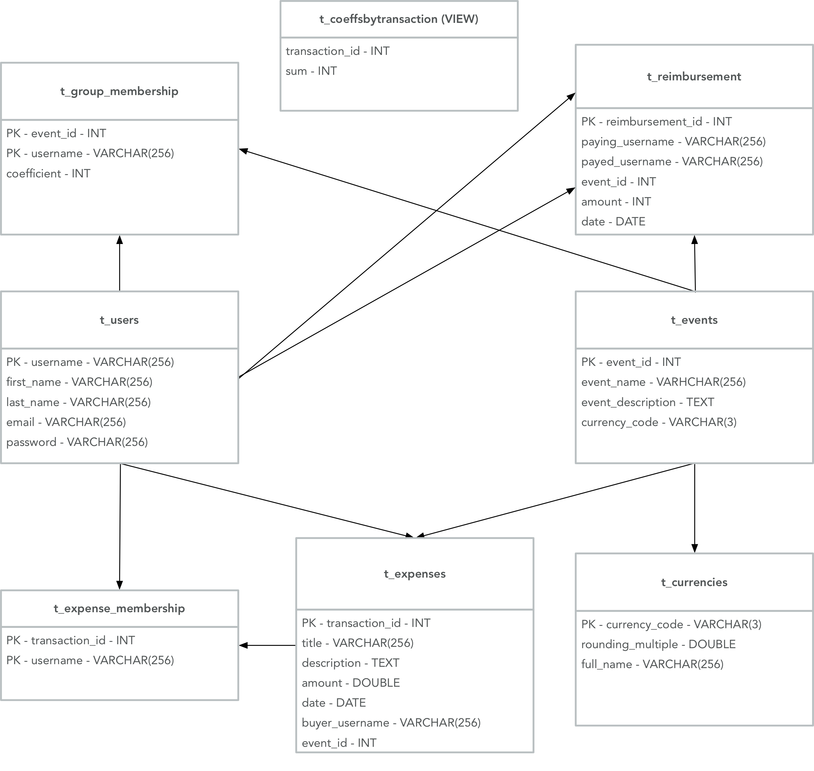
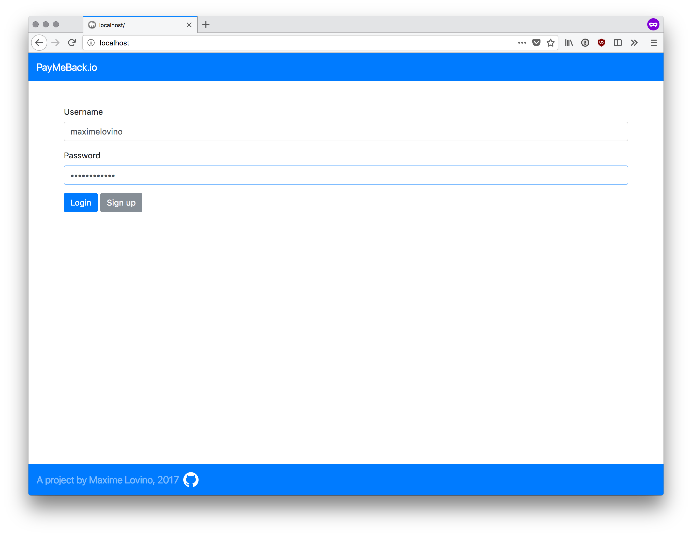

# PayMeBack.io - Rapport

## Introduction

PayMeBack.io est un site pour les groupes d'amis qui partent en vacances ou organisent un événement ensemble. Il permet à plusieurs amis de payer chacun pour quelque chose et au final d'afficher la balance de qui doit combien à qui.

Ce projet a été réalisé en PHP 7 avec une base de données MySQL.

### Fonctionnalités

Toute les fonctionnalités demandées sont présentes. On pourrait encore ajouter la modification d'un paiement, remboursement ou événement car pour l'instant en cas de changements, il faut supprimer et recréer un de ces éléments.

## Structure de la base de données



### t_users

Cette table contiendra donc les informations sur les utilisateurs, y compris le hash de leur mot de passe pour l'authentification.

### t_events

Cette table contient la liste des événements, la colonne `event_id` est l'identifiant de l'événement qui s'auto-incrémente à chaque insertion.

### t_currencies

Cette table définit une liste de monnaies disponibles lors de la création d'événements. Elle regroupe également des infos sur comment sont arrondies les différentes monnaies.

### t_group_membership

Cette table sert à définir l'appartenance d'un utilisateur à un événement ainsi que son coefficient dans cet événement.

### t_expenses

Cette table contient la liste des dépenses, avec une référence à l'ID de l'événement en question.

### t_expense_membership

Cette table définit les utilisateurs concernés par une dépense.

### t_reimbursement

Cette table contient les remboursements (ou paiements directs) d'un utilisateur à un autre.

### t_coeffsbytransaction

Cette vue a été créé pour pouvoir accéder facilement à la somme des coefficients pour chaque dépense, étant donné que le `SELECT` correspondants est assez long, du coup une vue a été faite pour directement accéder aux informations.

## Structure du projet

Etant donné l'envergure assez restreinte de ce projet, j'ai décidé de ne pas faire de MVC ni spécialement d'utiliser l'orienté objet de PHP pour les données à traiter. Je n'ai également pas utilisé de frameworks ou de générateurs de code et ai tout fait "from scratch" à l'exception du CSS qui vient de Bootstrap.

Deux classes ont été réalisées uniquement.

### DBConnection.php

Il s'agit ici d'une classe suivant le pattern singleton et fournissant une instance de connexion à notre base de données sur laquelle on pourra appeler des fonctions pour récupérer des informations à partir des différentes tables de la base. Cette classe contient toutes les interactions de récupération de données depuis la BDD.

### DataValidator.php

Il s'agit ici d'une classe non instantiable contenant uniquement des fonctions statiques servant à la validation des données à la réception des formulaires. Cette classe contient donc des fonction qui vérifient la validité des données saisies à l'aide de RegEx ainsi que leur logique en interrogeant la BDD, par exemple pour vérifier qu'un utilisateur a accès à un certain événement.

### Pages

Le projet est basé sur quelques pages. Nous avons `index.php` qui est la page de login et `signup.php` la page d'inscription. Toutes les autres pages vont renvoyer vers `index.php` si on est pas connectés. Ensuite nous avons la page d'accueil de l'utilisateur connecté `home.php` et la pages `events.php` qui selon si l'on passe un paramètre `id` va contenir la page d'un événement unique ou la page de tous les événements.

### Modals

J'ai décidé d'utiliser beaucoup de modals Bootstrap parce que cela donne un bel effet avec les animations et donne un look moderne. Ces modals sont utilisé pour les vues détaillées d'un paiement ou remboursement ainsi que pour les confirmations de suppression et les formulaires de création.

#### Formulaires

Les formulaires sont donc réalisés dans des modals Bootstrap et toutes leurs réponses sont traitées dans `events.php` qui est la page les englobant tous. A partir de là, si un formulaire n'est pas valide, on va le faire réapparaître en gardant son contenu et en donnant un feedback à l'utilisateur sur les champs non valides.

Cela est normalement assez rare car Bootstrap inclut une bonne partie de vérification "client-side" mais rien n'empêche l'utilisateur de modifier ce code, du coup il faut valider aussi "server-side".

#### Delete

Ce dossier contient toutes les modals de confirmation de suppression et le code appelant ces suppressions auprès de `DBConnection`.

### Ajax, JQuery et Fetch

Dans ce projet, j'ai utilisé un mélange d'Ajax et de fetch JavaScript pour effectuer des requêtes GET sur les API ou pour obtenir des pages PHP à travers des GET. En fait, à une époque, l'Ajax était le seul moyen de faire ce type de requête asynchrone. Mais désormais, dans les versions récentes de JavaScript ( à partir d'ES6 je crois bien) il existe `fetch` qui permet d'effectuer le même type de requête et renvoie une `promise` qui sera traitée lors de l'arrivée de la réponse. Par exemple, un code qui ressemble à ce qui se trouve sur la page d'accueil:

```javascript
let request = new Request(`http://api.fixer.io/latest?base=EUR&symbols=CAD`);
fetch(request).then((response) => response.json()).then((res) => {
  console.log(res)
}
```

Ici donc, on effectue une requête qui renvoie une `promise` et ensuite, lorsque la requête est finie, on va interpréter en json, ce qui renvoie aussi une `promise` et lorsque cela est finie, on peut afficher le résultat en JSON.

Pour ce qui est des sélecteurs, JavaScript propose désormais également un équivalent du classique sélecteur JQuery qui est tout aussi efficace, qui est `document.querySelector()`.

Malheureusement j'ai commencé à utiliser ces nouvelles méthodes en cours de projet d'où un certain manque de consistence entre la partie JQuery/Ajax et la partie JavaScript moderne.

### Select 2

Un plugin JQuery appelé [Select 2](https://select2.org/) a été utilisé pour rendre le `select multiple` utilisé lors de la création d'événement cherchable. Cela nous permet de filtrer la liste des utilisateurs au clavier et de les ajouter un par un à la manière de tags sur certains sites web. Son utilisation est basé sur un `select multiple` classique sur lequel le plugin est activé et il fait sa transformation. Du point de vue du formulaire, l'input fonctionne comme un `select multiple` classique.

### API fixer.io et page d'accueil

Sur la page d'accueil, l'utilisateur connecté obtient un résumé de sa balance dans les différentes monnaies de ces événements et a un moyen de rassembler sa balance totale dans la monnaie de son choix pour se faire une idée de ce qu'il doit au total. Pour ce faire, j'utilise une API Rest appelée `fixer.io` qui me permet d'avoir le taux de change actuel entre différentes monnaies. Cette API renvoie une réponse au format JSON, si on prend un exemple de requête, cela donne pour cette requête:

```
GET http://api.fixer.io/latest?base=EUR&symbols=CAD
```

Le résultat suivant:

```json
{
    "base": "EUR",
    "date": "2017-11-01",
    "rates": {
        "CAD": 1.4986
    }
}
```

Ce qui nous obtient donc le taux de change entre l'Euro et le Dollar Canadien.

## Marche à suivre pour l'utilisateur

### Connexion

Pour la connexion, il suffit de rentrer son login/mot de passe et de cliquer sur login.



### Inscription

Pour l'inscription, il faut cliquer signup sur la page d'accueil et vous serez redirigé vers une page pour signup:


### Création d'un événement

Depuis la page `events.php` vous pourrez créer un événement en cliquant sur "Create event"


### Création d'une dépense

Depuis la page individuelle d'un événement, on peut créer une dépense en cliquant sur "New expense"


### Création d'un remboursement

On peut également créer un remboursement depuis cette page en cliquant sur "New direct payment"


## Déploiement

Tout d'abord, sur une machine linux, il faudra installer Apache et MySQL avec la commande:

```
sudo apt-get install apache2 mysql-server php7.0 libapache2-mod-php7.0 php7.0-mysql
```

L'installation du serveur MySQL vous demandera de saisir un mot de passe root pour le serveur MySQL.

Ensuite, il faut se connecter à la base MySQL à l'aide de la commande:

```
mysql -u root -p
```

Et ensuite rentrer le mot de passe root défini précedemment.

Ensuite, depuis le prompt de MySQL, nous allons charger le fichier sql (le fichier sql est `db/sql.db`) concernant la configuration de la base de données avec la commande suivante:

```
source <path_to_sql_file>;
```

Ce script crée également 7 users que vous pourrez ajouter aux événements que vous allez créer avec l'user que vous aurez créé sur la page de signup.

Ensuite, il suffira de copier tous les fichiers contenus dans le dossier `src` dans le dossier racine du serveur apache, c'est-à-dire `/var/www/html`.

Une connexion internet est nécessaire car certains scripts et CSS sont chargés via des CDN.